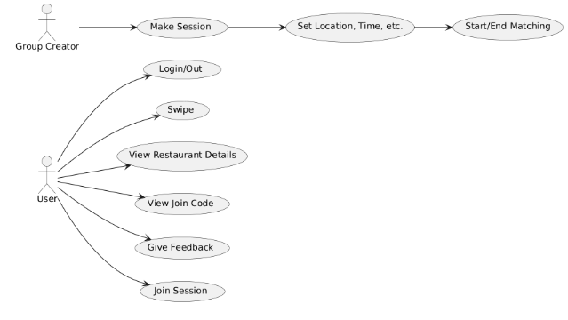
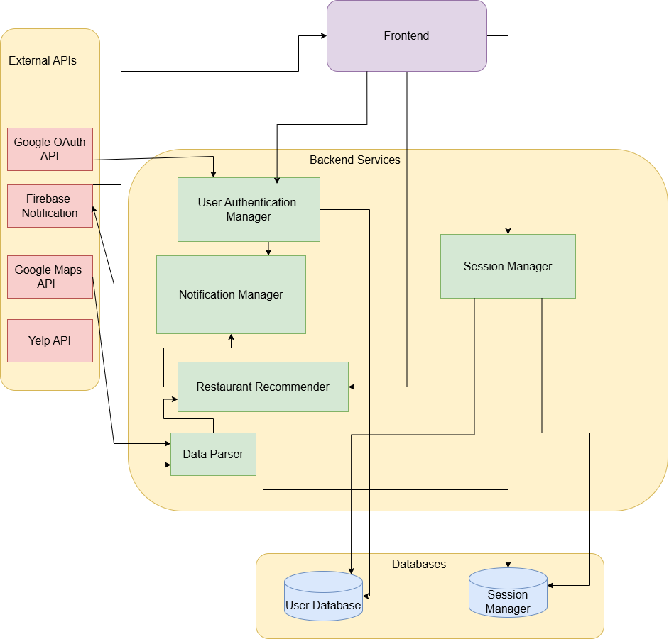
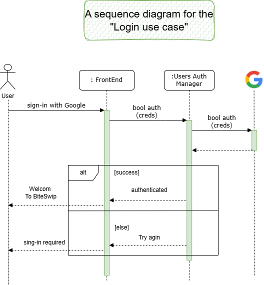
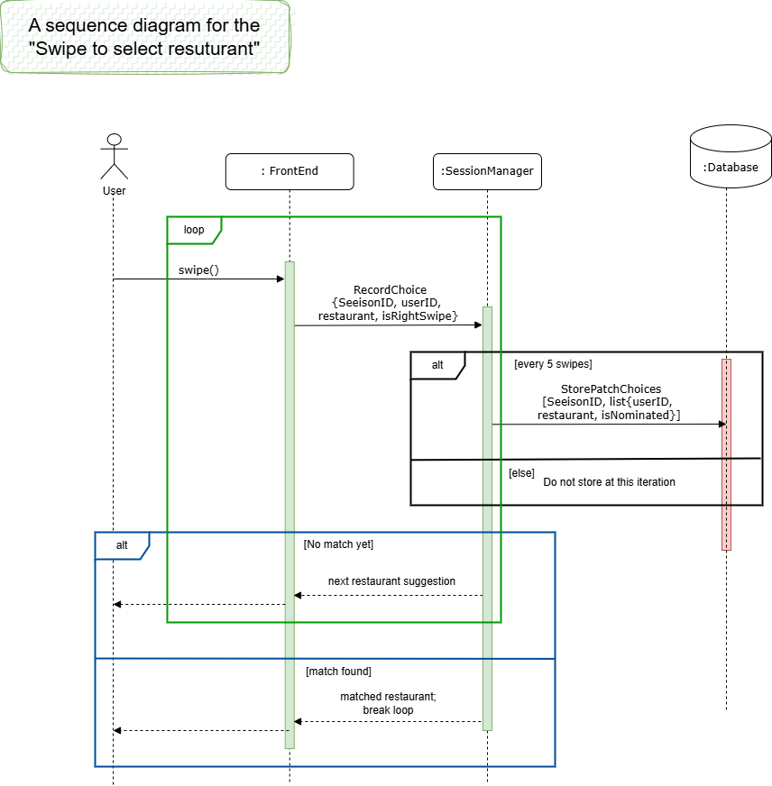
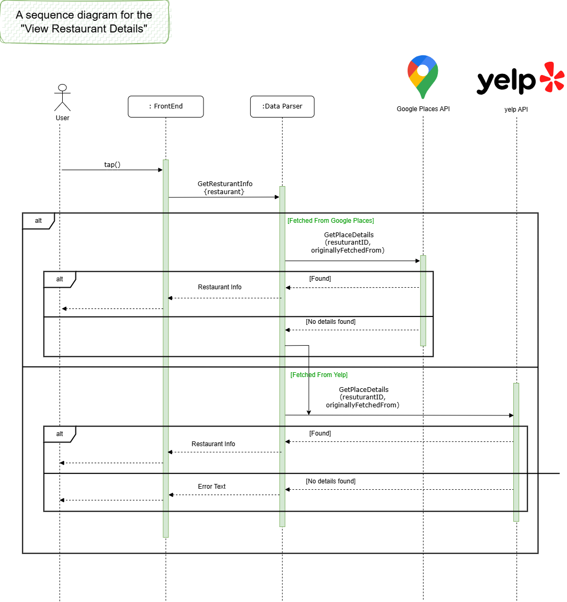
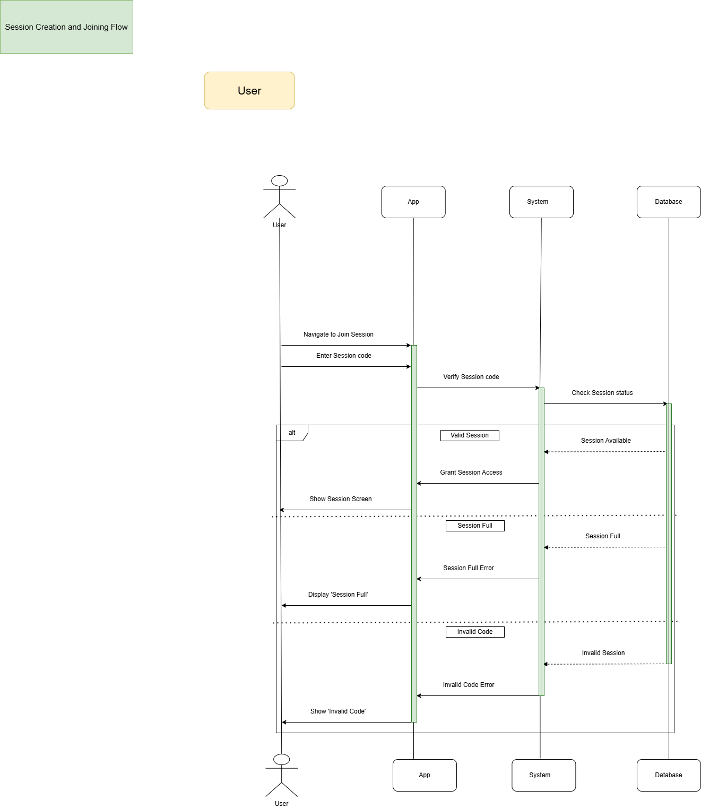
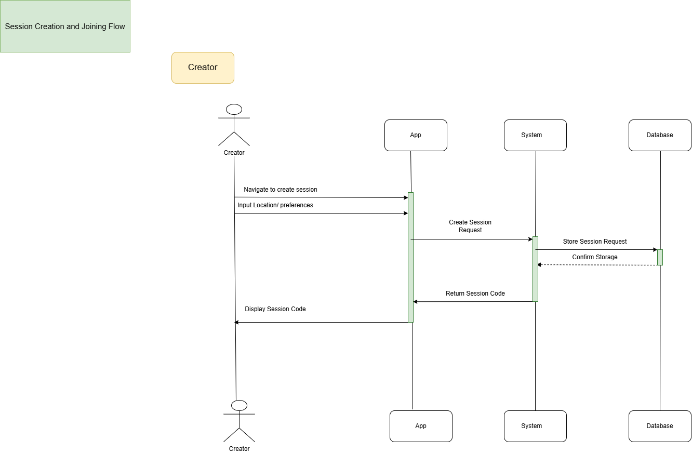
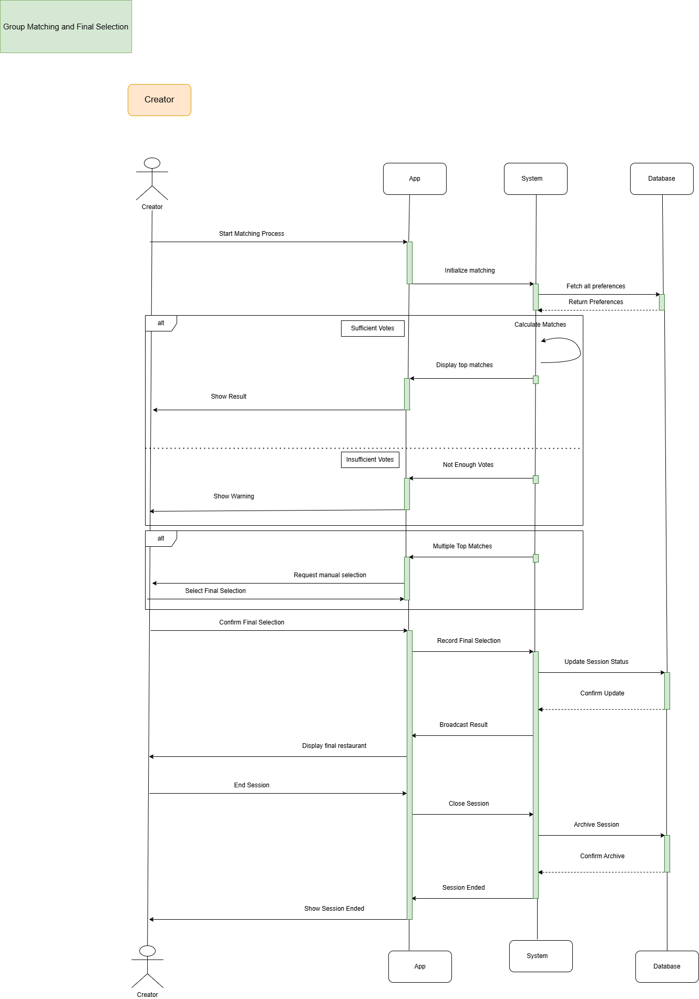

# **M3 - Requirements and Design**

## **1\. Change History**

Wed Jan 29: Creation, Formatting and typing up a document

Thu Jan 30: Completed section 3 (Requirements Specification) and section 4.1,4.2,4.3, 4.4.

Fri Jan 31: Completed Section 3 and 4 Diagrams (4.5 onwards)

## **2\. Project Description**

BiteSwipe is an Android app designed to simplify the process of choosing a restaurant for groups of friends.

The target audience for BiteSwipe includes groups of friends, families, and coworkers who frequently struggle with choosing a place to eat for breakfast, lunch or dinner. Deciding on a restaurant can often be a time-consuming and frustrating experience, with differing tastes, preferences, and dietary restrictions making it hard to reach a consensus. BiteSwipe addresses this issue by providing a simple, gamified, and collaborative way to streamline restaurant selection.

In today’s busy world, people value convenience and efficiency. BiteSwipe is designed to reduce friction and ensure that group dining plans are decided quickly and fairly. By incorporating a visually engaging swiping mechanism and group voting, BiteSwipe removes the guesswork and avoids lengthy debates, enhancing the dining-out experience.

## **3\. Requirements Specification**

### **3.1. Use-Case Diagram**



### **3.2. Actors Description**

1. **User**: A general participant in the app who can log in, swipe through restaurant options, view details, join group sessions, and provide feedback. Users collaborate with others to collectively decide on a restaurant.
2. **Group Creator**: A user who creates a dining session by setting the location, time, and preferences. They are automatically included in the session and can manage the restaurant matching process for the group.

### **3.3. Functional Requirements**

#### **1\. User Login**

- **Description:** The user must be able to log in and out of the app using **Google authentication** instead of manually entering credentials.
- **Primary actor(s):** User
- **Success scenario(s):**
    1. User opens the app.
    2. User taps the "Sign in with Google" button.
    3. System redirects to Google's authentication page.
    4. User selects or enters their Google account credentials.
    5. System verifies authentication with Google and grants access.
    6. User can log out at any time from the settings menu.
- **Failure scenario(s):**
    1. User denies Google authentication request.
        - System returns to the login screen with a message: "Sign-in required."
        - User retries login and grants access.
    2. Network failure during authentication.
        - System displays "No internet connection. Please try again."
        - User retries login once the network is restored.
    3. Google authentication service is unavailable.
        - System displays an error: "Google sign-in is currently unavailable."
        - User is advised to try again later.

#### **2\. Swipe to Select Restaurants**

- **Description:** The user can swipe left or right on restaurant options, indicating interest or disinterest in a given restaurant.
- **Primary actor(s):** User
- **Success scenario(s):**
    1. User is presented with a restaurant suggestion.
    2. User swipes right to like or left to dislike.
    3. System stores the user’s preference.
- **Failure scenario(s):**
    1. No available restaurants.
        - System displays a message: "No more restaurants available."
        - User must wait for more restaurant data to refresh.
    2. Swipe action does not register.
        - System prompts the user to retry the swipe.
        - User attempts another swipe.

#### **3\. View Restaurant Details**

- **Description:** The user can tap on a restaurant card to view details, including location, reviews, and menu highlights.
- **Primary actor(s):** User
- **Success scenario(s):**
    1. User taps on a restaurant card.
    2. System displays detailed restaurant information.
- **Failure scenario(s):**
    1. Restaurant details fail to load.
        - System displays an error message.
        - User retries after refreshing the page.

#### **4\. Join a Session**

- **Description:** Users can enter a session code to join a group and participate in the restaurant selection process.
- **Primary actor(s):** User
- **Success scenario(s):**
    1. User navigates to the session join screen.
    2. User enters a valid session code.
    3. System verifies the code and grants access to the session.
- **Failure scenario(s):**
    1. Invalid session code entered.
        - System displays an error message: "Invalid code, please try again."
        - User reattempts with the correct code.
    2. Session is full.
        - System displays a message: "Session is full."
        - User must wait for a new session or request an invite.

#### **5\. Create a Session**

- **Description:** The group creator can start a new session, setting the location, time, and preferences.
- **Primary actor(s):** Group Creator
- **Success scenario(s):**
    1. Group creator navigates to the session creation screen.
    2. Group creator inputs location, time, and session preferences.
    3. System generates a session and automatically adds the creator.
    4. System provides a join code for other users.
- **Failure scenario(s):**
    1. Invalid input (missing location, etc.).
        - System prompts the user to fill in missing details.
        - Group creator completes the missing fields and retries.
    2. Server error prevents session creation.
        - System displays an error message.
        - Group creator retries after some time.

#### **6\. Start/End Matching**

- **Description:** The group creator can initiate and finalize the matching process, selecting the most preferred restaurant for the group.
- **Primary actor(s):** Group Creator
- **Success scenario(s):**
    1. Group creator initiates the matching process.
    2. System collects user preferences and determines the best match.
    3. System displays the final restaurant choice.
    4. Group creator can end the session once the match is finalized.
- **Failure scenario(s):**
    1. Not enough users have voted.
        - System alerts the group creator.
        - Group creator can wait or manually finalize the choice.
    2. Tie between restaurants.
        - System prompts the group creator to choose manually.
        - Group creator makes the final selection.

### **3.4. Non-Functional Requirements**

1. **Availability/Uptime**
    - **Description**: The app should maintain an uptime of at least 99.9%.
    - **Justification**: High availability is critical for ensuring users can create and join sessions without interruption.
2. **Scalability**
    - **Description**: The system should handle up to 1,000 concurrent sessions without performance degradation.
    - **Justification**: This ensures the app can accommodate peak usage times, such as during lunch or dinner hours
3. **Security Constraint**
    - **Description**: All authentication data (e.g., OAuth tokens) must be encrypted in transit and at rest.
    - **Justification**: Protects user data from unauthorized access or interception.

## **4\. Designs Specification**

### **4.1. Main Components**

1. **Session Manager**
    - **Purpose**: To only allow authenticated users to create and manage groups, and handle inter-group communication.
    - **Interfaces:** Frontend, Database
2. **Restaurant Recommender Algorithm**
    - **Purpose:** Provide the user group with recommendations for where to eat. This is based on initial parameters set by the group leader, user cuisine preferences, restaurant rating, and live fed swipe data.
    - **Interfaces:** Frontend, Database, Data Parser
3. **Data Parser**
    - **Purposes:** Used to parse incoming data from restaurant APIs (Yelp, Google Maps API) to get into a consistent format
    - **Interfaces:** Restaurant Recommender Algorithm, Yelp/Google Maps API, Database
4. **User Authentication/Manager**
    - **Purpose:** Ensure only authenticated users can log in and use the application for security purposes
    - **Interfaces:** Database, Frontend
5. **Notification Manager**
    - **Purposes:** Deliver Notifications when group has matched, or when invited to a group
    - **Interfaces:** Restaurant Recommender Algorithm, Frontend, User Authentication/Manager, Firebase Notifications

### **4.2. Databases**

1. **User Database**
    - **Purpose**: Used to keep track of user details. This includes past selected restaurants, username, and session status.
2. **Session Manager Database**
    - **Purpose** To keep track of active groups, users involved and sending the right recommendations to the right user. Allows for multiple sessions to run, not just one.

### **4.3. External Modules**

1. **Google Maps API**
    - **Purpose**: Will be used to pull data on restaurants including location, rating, menu, price and cuisine. Selected as it has the most accurate data amongst other sources and has low costs for students.
2. **Google OAuth API**
    - **Purpose:** Used for user authentication and security. Selected due to group familiarity and as it is the most common method of signup on Android devices.
3. **Yelp API**
    - **Purpose:** Used as a backup API to pull any missing elements the Google Maps API is unable to provide for some restaurants. Selected as it is frequently used to book tables, but isn’t as good as the Maps API as it is Paid and Rate-limited.

### **4.4. Frameworks**

1. **Amazon Web Services**
    - **Purpose:** Used for the deployment of the backend. This includes both the cloud compute and the certificate management to maintain HTTPS status. Selected as it has a free EC2 tier and is easiest to configure among Azure/GCP/AWS options.
    - **Interfaces:** Backend, Hosting
2. **MongoDB**
    - **Purpose:** Used to store user data on the backend. Selected as group has very little experience with SQL, and has project experience with MongoDB.
    - **Interfaces:** Backend modules, Database
3. **GitHub**
    - **Purpose:** Used for keeping track of code written by group, as well as deployment pipeline. Selected thanks to its simplicity in source control.
    - **Interfaces:** Workflow, CI/CD Pipeline
4. **Docker**
    - **Purpose:** Used to containerize applications and their dependencies, ensuring consistent environment across development and production, Enables easy deployment and scaling of microservices. Selected as team has prior experience with managing docker containers, and not much with Kubernetes.
    - **Interfaces:** Containers, Application Runtime, Development Environment
5. **Firebase Notifications**
    - **Purpose:** To push notifications to the user when invited to a group, or when a group matching restaurant has been found. Selected as it’s the only option allowed by the course syllabus.
    - **Interfaces:** Notification Manager, Frontend

### **4.5. Dependencies Diagram**


### **4.6. Functional Requirements Sequence Diagram**

1.  **Sequence Diagram for Login  <br>**

2. **Sequence Diagram for Swipe to Select Restaurant  <br>**

3. **Sequence Diagram for View Restaurant Details  <br>**

4. **Sequence Diagram for Joining a Session as a User  <br>**

5. **Sequence Diagram for Session Creation as a Creator  <br>**

6. **Sequence Diagram for Group Matching as a User  <br>**
.png)
7. **Sequence Diagram for Group Matching as a Creator  <br>**


### **4.7. Non-Functional Requirements Design**

1. **Availability/Uptime**
    - **Validation**:
        - The backend services will be deployed using **cloud-based infrastructure** (e.g., AWS EC2 instances) with **multi-region failover** to ensure high availability.
        - Real-time monitoring tools (e.g., AWS CloudWatch) will track system health and automatically restart failed services.
    - **Design Implementation**:
        - A minimum of **two active server instances** will always handle requests to provide redundancy.
        - Service downtime will be measured and logged against the **99.9% availability goal** using monitoring services (e.g., uptime robots).
2. **Scalability**
    - **Validation**:
        - The backend must support up to **1,000 concurrent sessions** without performance degradation.
        - Performance testing tools (e.g., Apache JMeter or Locust) will simulate peak usage conditions.
        - The response time for 95% of requests should not exceed **500ms** during peak load.
    - **Design Implementation**:
        - **Horizontal scaling** will be used, allowing additional instances to spin up automatically under high load.
        - **Caching strategies** (e.g., Redis) will reduce frequent database queries, improving response time.
        - Critical services (e.g., session and restaurant management) will be deployed as independent, scalable microservices to distribute the load.
3. **Security Constraint**
    - **Validation**:
        - Penetration tests will ensure that **OAuth tokens** (issued by Google) and other sensitive data are protected from unauthorized access or interception.
        - Security scanners (e.g., OWASP ZAP) will verify that all data is transmitted securely via **HTTPS (TLS 1.2 or higher)**.
        - An audit will ensure that **encryption at rest** is applied to sensitive fields in the database (e.g., OAuth tokens, user profile data).
    - **Design Implementation**:
        - The app will authenticate users using **Google OAuth**. Google will issue **ID and access tokens**, which will be securely transmitted to the backend over **HTTPS**.
        - The backend will verify and validate the **Google-issued tokens** using public keys from Google's OAuth service (<https://www.googleapis.com/oauth2/v3/certs>).
        - OAuth tokens will be:
            - **Encrypted** at rest on the backend.
            - **Short-lived**, with a **token refresh mechanism** in place to replace expired tokens securely.
        - The backend will enforce strict HTTPS for all communication to prevent token interception during transmission.

### **4.8. Main Project Complexity Design**

**Real-time Ranking Algorithm**

- **Description**: At the start of a session, restaurant recommendations are presented in a random order. As users swipe right on restaurants they like, the backend dynamically updates a ranked list based on group preferences. Over time, the algorithm prioritizes highly rated restaurants, ensuring that users are shown the most popular choices. By the end of the session, the group will have naturally converged on a few top restaurants, which are then presented as the final recommendations.
- **Why complex?**:

**Real-time updates across multiple users** – The ranking algorithm needs to update dynamically as swipes come in, ensuring minimal latency while synchronizing preferences across all users in the session.

**Balancing diversity vs. convergence** – Initially, users should see a broad selection of restaurants, but as the session progresses, the algorithm must intelligently shift towards the most popular options without eliminating diversity too soon.

**Handling ties and fairness** – The system needs to ensure that ties are resolved fairly and that restaurants are not shown too frequently to any one user, while still promoting group consensus.

- **Design**:

    **Input**:

    - User swipes (right = like, left = dislike)
    - Session ID (to track votes within a group)
    - Restaurant pool (list of available restaurant options)

    **Output**:

    - Updated restaurant ranking for the session
    - Personalized recommendation list for each user
    - Final top-ranked restaurant list at the end of the session

    **Main computational logic**:

    - Initialization – At session start, restaurants are presented in random order.
    - Real-time ranking update – Every time a user swipes right, the restaurant's score increases in the session ranking.
    - Dynamic weighting – Restaurants with higher scores are prioritized in future recommendations. However, to maintain some diversity, a small randomization factor is added.
    - Convergence phase – As the session nears its end, diversity decreases and the system pushes the most popular restaurants to all users.
    - Final selection – At the end of the session, the top-ranked restaurants are displayed to the group for a final decision.

    **Pseudo-code**:
```
BEGIN SESSION
    Create a list of restaurants
    Set all restaurant scores to 0
    Show random restaurants to each user

    WHILE session is active:
        IF user swipes right on a restaurant:
            Increase that restaurant's score
        ELSE IF user swipes left:
            Do nothing (or slightly decrease score)
        
        Update rankings in real time
        Show more highly ranked restaurants over time
        Occasionally mix in a few random choices for variety

        IF all users swiped right on a restaurant:
            Suggest restaurant to all users with more information
            IF all users agree
                END SESSION

    NEAR END OF SESSION:
        Only show the top-ranked restaurants to all users

    END SESSION

    Select the top 3 restaurants based on total likes
    Display the final choices to the group
END
```
## **5\. Contributions**

- Alex Evans: Created UML for Use Case Diagram, Functional Requirements, Main Complexity Design (3 hours)
- Lakshya Saroha: Created Sequence Diagram, Dependency Diagram, Frameworks Description, translated document to .md (5 hours)
- Abdul Mohamed: Non-Functional Requirements, helped with Sequence Diagrams (5 hours)
- Varun Seshadri: Wrote Project Description, Main Components, External Modules, Databases and Frameworks, translated document to .md (4 hours)