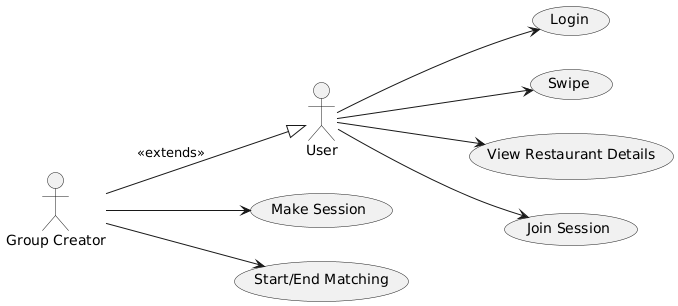
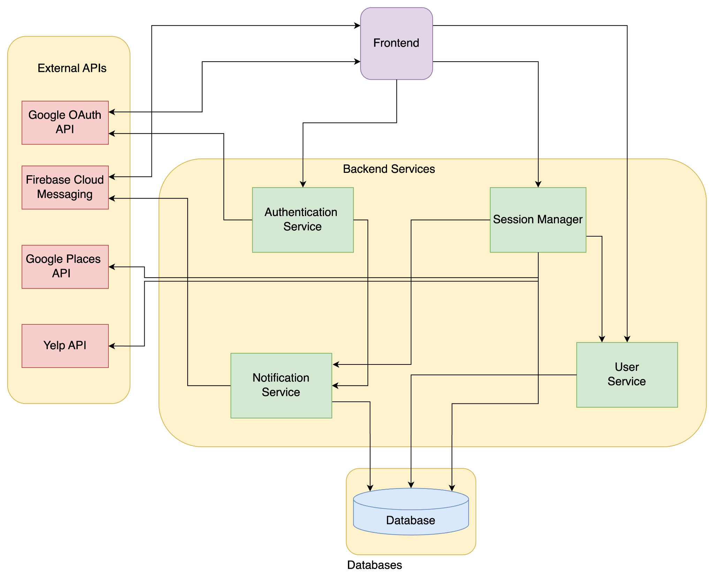
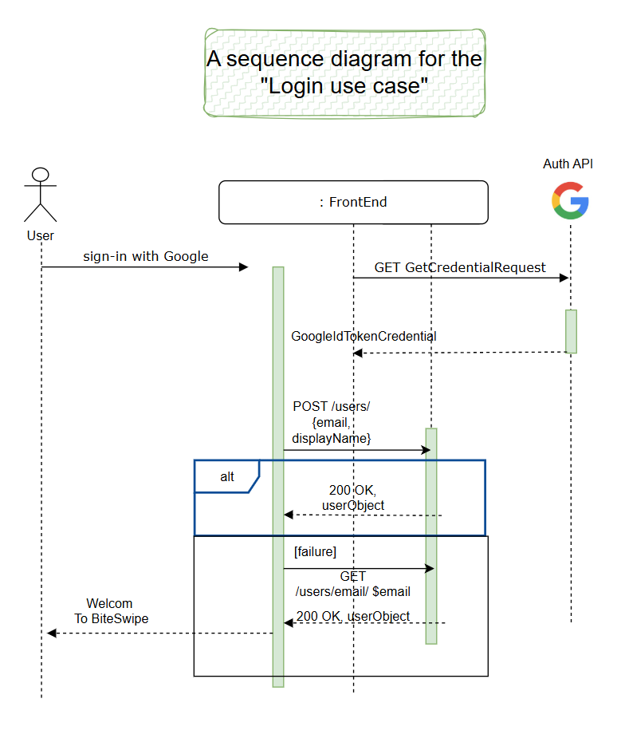
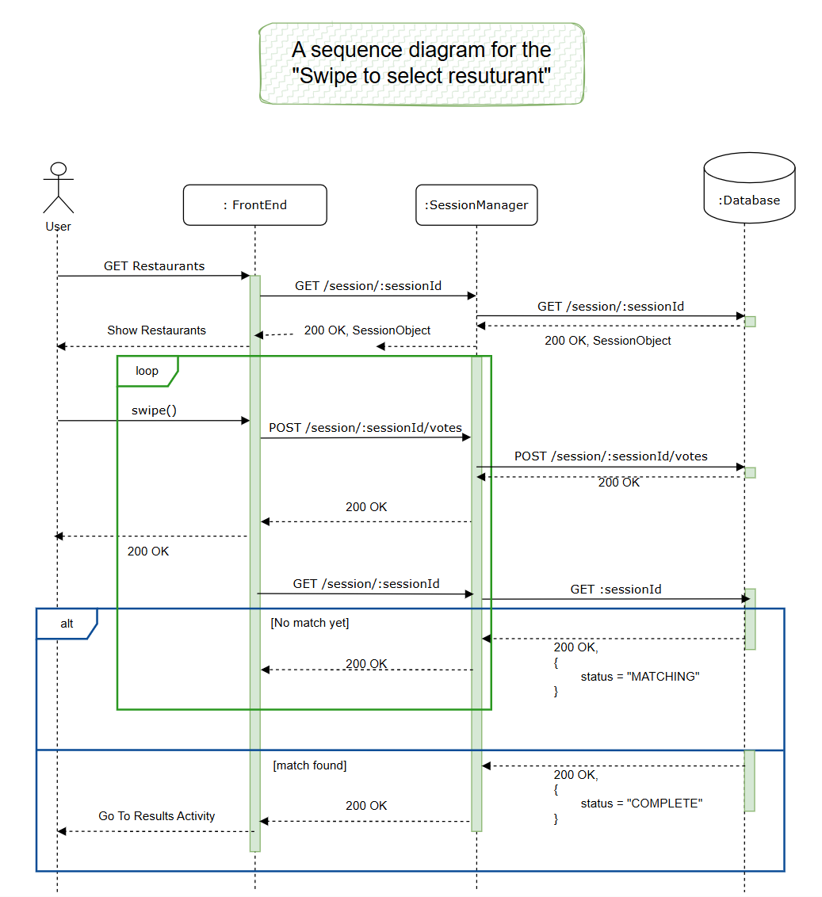
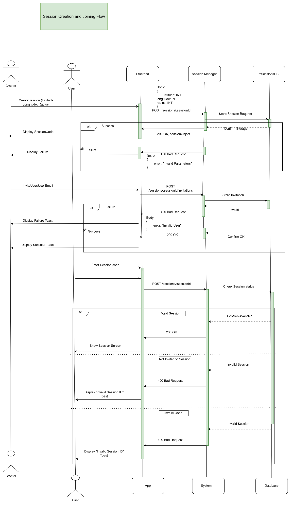

#  M4 - Requirements and Design

## **1. Change History**

Wed, Jan 29: Creation, Formatting and typing up a document

Mon, Mar 3: Comments made for improvements

Tues, Mar 4: Edited document for submission with new architecture and fixes from M3

## **2. Project Description**

BiteSwipe is an Android app designed to simplify choosing a restaurant for groups of friends.

The target audience for BiteSwipe includes groups of friends, families, and coworkers who frequently struggle with choosing a place to eat for breakfast, lunch or dinner. Deciding on a restaurant can often be a time-consuming and frustrating experience, with differing tastes, preferences, and dietary restrictions making it hard to reach a consensus. BiteSwipe addresses this issue by providing a simple, gamified, and collaborative way to streamline restaurant selection.

In today’s busy world, people value convenience and efficiency. BiteSwipe is designed to reduce friction and ensure that group dining plans are decided quickly and fairly. By inviting your friends, a push notification will be able to let them know you want to match. By incorporating a visually engaging swiping mechanism and group voting, BiteSwipe removes the guesswork and avoids lengthy debates, enhancing the dining-out experience.

## **3. Requirements Specification**

### **3.1. Use-Case Diagram**

### **3.2. Actors Description**

1. **User**: A general participant in the app who can log in, join group sessions, view session details, and swipe through restaurant options. Users collaborate with others to collectively decide on a restaurant.

2. **Group Creator**: A user who creates a dining session by setting the location, time, and preferences. They are automatically included in the session and can manage the group's restaurant matching process.

### **3.3. ****Functional Requirements**** **

#### **1.**** User Login**

- **Description:** The user must be able to log in and out of the app using **Google authentication** instead of manually entering credentials.

- **Primary actor(s):** User

- **Preconditions:**

1. The user has installed the application.

2. The user has an active internet connection.

4. **Postconditions:**

3. If successful, the user is logged into the application and has access to personalized features.

4. If unsuccessful, the system displays an appropriate error message and prompts the user to retry.

5. **Success scenario(s):**

5. The user opens the app.

6. The system displays the login screen with a "Sign in with Google" button.

7. The user taps the "Sign in with Google" button.

8. The system redirects the user to Google's authentication page.

9. The user selects or enters their Google account credentials.

10. The system verifies authentication with Google and grants access.

11. The system redirects the user back to the app, now logged in.

6. **Failure scenario(s):**

3a. The user denies the Google authentication request.

- 3a1. The system returns to the login screen with a message: "Sign-in required."

- 3a2. The user retries login and grants access.

5a. Network failure during authentication.

- 5a1. The system displays an error message: "No internet connection. Please try again."

- 5a2. The user retries login once the network is restored.

6a. Google authentication service is unavailable.

- 6a1. The system displays an error message: "Google sign-in is currently unavailable."

- 6a2. The user is advised to try again later.

#### **2. Swipe to Select Restaurants**

- **Description:** The user can swipe left or right on restaurant options, indicating interest or disinterest in a given restaurant.

- **Primary actor(s):** User

- **Preconditions:**

1. The user has installed the application.

2. The user is logged into the app.

3. The user has an active internet connection.

4. **Postconditions:**

4. If successful, the user has swiped on a restaurant, and the app displays the next restaurant suggestion (if available).

5. If no restaurants are available, the user sees an appropriate message and cannot continue swiping.

5. **Success scenario(s):**

6. The screen displays a restaurant suggestion, including the name, image, rating, and short description.

7. The user swipes right to like or left to dislike the restaurant.

8. The screen briefly shows a confirmation animation

9. A new restaurant suggestion appears.

10. Steps 3-5 repeat until no more restaurant suggestions are available.

11. If no restaurants remain, the app displays a message: "Waiting for other users to finish…"

6. **Failure scenario(s):**

1a. No restaurants are available when the user navigates to the selection screen.

- 1a1. Instead of showing a restaurant, the app displays the message: "No restaurants available at this time."

- 1a2. The user can exit the selection screen and return later.

4a. Network failure while loading the next restaurant.

- 4a1. The screen displays a message: "Network error. Please check your connection and try again."

- 4a2. The user can retry by tapping "Reload", or exit the screen.

#### **3. View Restaurant Details**

- **Description: **The user can tap on a restaurant card to view details, including location, reviews, and menu highlights.

- **Primary Actor(s): **User

- **Preconditions:**

- The user has installed the application.

- The user is logged into the app.

- The user has an active internet connection.

- There are restaurants available to view.

- **Postconditions:**

- If successful, the restaurant details screen is displayed.

- If unsuccessful, the user sees an error message and may retry.

- **Success Scenario(s):**

1. The user is on the restaurant selection screen.

2. The user taps on a restaurant card.

3. The screen transitions to the restaurant details page.

4. The restaurant details page displays the following information:

- Restaurant name

- Location and map preview

- Average rating and user reviews

- Menu highlights

- Contact details (if available)

- The user can scroll through the details or return to the previous screen by tapping the back button.

**Failure Scenario(s):**

#### 2a. Restaurant details fail to load.

- 2a1. The screen displays an error message: "Unable to load restaurant details. Please try again."

- 2a2. The user can tap "Retry" to attempt loading again or navigate back to the previous screen.

#### 2b. Network failure while loading details.

- 2b1. The screen displays a message: "No internet connection. Please check your connection and try again."

- 2b2. The user can retry after restoring their internet connection.

### **4. Join a Session**

- **Description:** The user can join an existing session by entering a join code and accessing the group member list.

- **Primary actor(s):** User

- **Preconditions:**

- The user is logged into the app.

- The user has an active internet connection.

- The user has a valid join code for an existing session.

- **Postconditions:**

- If successful, the user joins the session and sees the list of group members.

- If unsuccessful, the user is prompted to re-enter the join code or try again later.

- **Success scenario(s):**

- The user is on the home page.

- The user taps the "Join Group" button.

- The system displays a text input field labeled "Enter Join Code".

- The user enters a valid join code and taps "Join".

- The system verifies the code and processes the request.

- The screen transitions to the Group Members page, displaying:

- The session name

- A list of all members in the group

- The user is now part of the session and can participate in group activities.

- **Failure scenario(s): \
**4a. The user enters an invalid or expired join code.

- 4a1. The system displays an error message: "Invalid or expired join code. Please try again."

- 4a2. The user can re-enter the correct code or request a new one from the group creator.

- 5a. Network failure during verification.

- 5a1. The system displays a message: "Network error. Please check your connection and try again."

- 5a2. The user can retry by tapping "Try Again" or return to the home page.

- 5b. The session is full.

- 5b1. The system displays an error message: "This session is full and cannot accept more members."

- 5b2. The user is returned to the join screen and must find another session.

### **5. Make Session**

1. **Description:** The group creator can start a new session by setting the location, time, and cuisine preferences.

2. **Primary actor(s):** Group Creator

3. **Preconditions:**

1. The user is logged into the app.

2. The user has an active internet connection.

4. **Postconditions:**

3. If successful, a session is created, and the group creator receives a join code.

4. If unsuccessful, the user is prompted to retry due to missing details or server errors.

5. **Success scenario(s):**

1. The group creator taps the “Create Group” button from the main page.

2. The screen displays input fields for:

1. Radius

2. Cuisine preferences

3. The group creator enters the required details.

4. The group creator taps the "Create Session" button.

5. The screen displays a loading indicator.

6. The system confirms session creation and displays:

3. A confirmation message

4. A unique join code for other users to join the session

5. A list of Users in the session

6. A Start Matching Button

6. **Failure scenario(s):**

**3a. Invalid input (missing location or preferences).**

5. 3a1. The system highlights missing fields and displays a message: "Please fill in all required fields."

6. 3a2. The group creator completes the missing fields and retries.

**6a. Server error prevents session creation.**

7. 6a1. The system displays an error message: "Unable to create session. Please try again later."

8. 6a2. The group creator can retry after some time.

#### **6. Start/End Matching**

**Description:** The group creator can initiate and finalize the matching process, selecting the most preferred restaurant for the group.

**Primary actor(s):** Group Creator

**Preconditions:**

1. The user is logged into the app.

2. The user has an active internet connection.

3. A session has been created.

4. At least one other user has joined the session.

**Postconditions:**

1. If successful, the system determines the best restaurant match and displays the result.

2. If unsuccessful, the group creator is prompted to resolve the issue manually.

**Success scenario(s):**

1. The group creator taps the **"Start Matching"** button.

2. All users are shown the matching page and swipe to select.

3. The system displays the selected restaurant with:

- Restaurant name

- Image and description

- Address and map preview

- The group creator taps **"End Session"** to finalize the selection.

- The session ends, and users are notified of the final selection.

**Failure scenario(s): \
3a. Not enough users have voted.**

- 3a1. The system alerts the group creator: "Not enough votes to determine a match."

- 3a2. The group creator can either:

- Wait for more users to vote.

- Tap "Manually Finalize" to choose a restaurant.

**3b. No more restaurants are available.**

- 3b1. The system displays the message “Waiting on others to finish…”

- 3b2. Once all users get this message, the system will go to results and display the best fit restaurant, should it exist.

**4a. Tie between restaurants.**

- 4a1. The system displays a message: "Multiple restaurants have equal votes."

- 4a2. The system prompts the group creator to manually select a restaurant.

- 4a3. The group creator selects the final restaurant.

- 4a4. The system displays the final choice.

### **3.4. Non-Functional Requirements**

1. **Availability/Uptime**

- **Description:** The app should maintain a minimum uptime of 80%, allowing for occasional maintenance downtime while ensuring accessibility.

- **Justification: **This ensures users can create and join sessions without frequent disruptions. 70% uptime equates to ~146 hours of downtime per month, which is reasonable for a course project and aligns with industry best practices for non-critical applications.

- **Usability**

- **Description: **The app should allow a new user to create or join a session within 30 seconds on their first attempt.

- **Justification: **This ensures the UI is intuitive and requires minimal onboarding. The 30-second benchmark is based on common usability heuristics for simple onboarding flows.

- **Performance**

- **Description:** The app should load the home screen within 5 seconds under normal network conditions (Wi-Fi or 4G LTE).

- **Justification:** A 5-second load time aligns with Google’s recommended app performance metrics for good user experience. Reference: [App startup time  |  App quality  |  Android Developers](https://developer.android.com/topic/performance/vitals/launch-time#av)

## **4. Designs Specification**

### **4.1. Main C****omponents**

1. **Session Manager:**

**Purpose: **Manages group sessions and restaurant data, including:

1. Storing a list of restaurants for each session in the database

2. Tracking user swipes and calculating match scores

3. Managing session state (creation, joining, swiping, completion)

4. Integrating with Google Places API to fetch restaurant data

**Interfaces**: Frontend, Database, Google Places API, Notification Service

2. **Authentication Service:**

**Purpose: **Handles user authentication through Google Sign-In, ensuring secure access to the application. 

**Interfaces**: Frontend, Database, Google Authentication API

3. **Notification Service:**

**Purpose: **Manages Firebase Cloud Messaging (FCM) to deliver real-time notifications for session invites and matches.

**Interfaces**: Firebase Cloud Messaging, Session Manager

4. **User Service:**

**Purposes: **Manages user profiles, preferences, and session history, including:

5. Storing user authentication data

6. Tracking restaurant preferences and swipe history

7. Managing user relationships (friends, groups)

**Interfaces**: Database, Frontend, Session Manager

### **4.2. D****atabases**

1. **User Database:** 

**Purpose:**  Stores comprehensive user information including:

1. Authentication details (email, display name)

2. Session history (created, participated, timestamps)

3. Restaurant interaction history (likes/dislikes)

4. Firebase Cloud Messaging token for notifications

**Interfaces:** Session Database, Authentication Service

2. **Session Database**

**Purpose:** Manages active and historical session data including:

5. Session metadata (join code, creator, status)

6. Participant list and their preferences

7. Restaurant list with scoring data (total votes, positive votes)

8. Session settings (location, radius)

9. Final restaurant selection

**Interfaces:** User Database, Restaurant Database

3. **Restaurant Database** 

**Purpose:** Stores restaurant information fetched from Google Places API:

10. Basic details (name, location, contact)

11. Rich content (photos, menu categories)

12. Source metadata (Google Place ID)

13. Aggregated user interactions

**Interfaces:** Google Places API, Session Database

### **4.3. Extern****al Modules**

1. **Google Places API** 

**Purpose:** Primary source for restaurant data, providing comprehensive information including:

1. Location coordinates and address

2. Business details (name, photos, website)

3. Restaurant metadata (place ID, types)

**Justification:** Offers reliable, up-to-date data with extensive coverage and reasonable free tier limits for development.

2. **Firebase Cloud Messaging (FCM)** 

**Purpose:** Handles real-time notifications for:

4. Session invitations

5. Group updates

6. Match notifications

**Justification:** Provides reliable push notifications with native Android support and a generous free tier.

3. **Google OAuth API**

**Purpose**: Manages secure user authentication through Google Sign-In, providing:

7. User identity verification

8. Profile information access

9. Secure token management

**Justification**: Offers seamless integration with Android devices and high security standards.

4. **Yelp API** 

**Purpose:** Used as a backup API to pull any missing elements the Google Maps API is unable to provide for some restaurants:

10. Detailed menu information

11. User reviews and photos

12. Reservation availability

**Justification:** Selected as it provides complementary data to Google Places API, particularly for menu details and user-generated content, despite being rate-limited.

### **4.4. Frameworks**

1. **Microsoft ****Azure**

- **Purpose:** Provides cloud infrastructure for backend deployment, including:

1. Virtual machine hosting

2. SSL/TLS certificate management

3. Network security and load balancing

2. **Justification:** Selected as development costs are covered by the course and offer comprehensive cloud services.

3. **Interfaces:** Backend, Hosting

2. **MongoDB** 

4. **Purpose:** NoSQL database system used for:

4. Storing user profiles and preferences

5. Managing session data and restaurant information

6. Tracking user interactions and swipe history

5. **Justification:** Selected for its flexibility with JSON-like documents and team's prior experience with NoSQL databases.

6. **Interfaces:** Backend modules, Database

3. **GitHub** 

7. **Purpose**: Manages development workflow through:

7. Version control and code collaboration

8. Automated CI/CD pipeline

9. Issue tracking and project management

8. **Justification:** Provides robust version control and seamless integration with development tools. 

9. **Interfaces:** Workflow, CI/CD Pipeline

4. **Docker**

10. **Purpose:** Containerization platform used for:

10. Consistent development environments

11. Simplified deployment process

12. Service isolation and management

11. **Justification:** Enables reproducible builds and deployments across different environments with minimal configuration. 

12. **Interfaces:** Containers, Application Runtime, Development Environment

5. **Firebase**

13. **Purpose:** Provides essential backend services including:

13. Real-time push notifications

14. Cloud messaging infrastructure

15. Secure credential management

14. **Justification:** Offers native Android integration and comprehensive mobile backend services. 

15. **Interfaces:** Notification Service, Frontend

### **4.5. ****Dependencies ****Diagram**

### **4.6. Functional Requirements Sequence Diagram**

**2. Swipe to select the ****restaurant**** **

**3. View Restaurant Details**

**4. ****Session**** Creation and ****Join Flow**

**5. Group Matching and Final Selection (Will split the diagram into 2**) 

### **4.7. Non-Functional Requirements Design**

1. **Availability/Uptime**

- **Validation**:

- The backend services will be deployed using **cloud-based infrastructure** (e.g., AWS EC2 instances) with **multi-region failover** to ensure high availability.

- Real-time monitoring tools (e.g., AWS CloudWatch) will track system health and automatically restart failed services.

- **Design Implementation**:

- A minimum of **two active server instances** will always handle requests to provide redundancy.

- Service downtime will be measured and logged against the **99.9% availability goal** using monitoring services (e.g., uptime robots).

- **Scalability**

- **Validation**:

- The backend must support up to **1,000 concurrent sessions** without performance degradation.

- Performance testing tools (e.g., Apache JMeter or Locust) will simulate peak usage conditions.

- The response time for 95% of requests should not exceed **500ms** during peak load.

- **Design Implementation**:

- **Horizontal scaling** will be used, allowing additional instances to spin up automatically under high load.

- **Caching strategies** (e.g., Redis) will reduce frequent database queries, improving response time.

- Critical services (e.g., session and restaurant management) will be deployed as independent, scalable microservices to distribute the load.

- **Security Constraint**

- **Validation**:

- Penetration tests will ensure that **OAuth tokens** (issued by Google) and other sensitive data are protected from unauthorized access or interception.

- Security scanners (e.g., OWASP ZAP) will verify that all data is transmitted securely via **HTTPS (TLS 1.2 or higher)**.

- An audit will ensure that **encryption at rest** is applied to sensitive fields in the database (e.g., OAuth tokens, user profile data).

- **Design Implementation**:

- The app will authenticate users using **Google OAuth**. Google will issue **ID and access tokens**, which will be securely transmitted to the backend over **HTTPS**.

- The backend will verify and validate the **Google-issued tokens** using public keys from Google's OAuth service (`https://www.googleapis.com/oauth2/v3/certs`).

- OAuth tokens will be:

- **Encrypted** at rest on the backend.

- **Short-lived**, with a **token refresh mechanism** in place to replace expired tokens securely.

- The backend will enforce strict HTTPS for all communication to prevent token interception during transmission.

### **4.8. Main Project Complexity Design**

**Real-time Ranking Algorithm**

- **Description**: The system implements a dynamic restaurant ranking system that evolves throughout a group session. Each restaurant starts with a neutral score, and as users interact through swipes, their preferences are weighted and aggregated in real-time to influence restaurant recommendations for all session participants.

- **Why complex?**: 

- Concurrent User Interactions

- Multiple users simultaneously submitting preferences

- Real-time score updates without race conditions

- Maintaining consistency across all user views

- Preference Aggregation

- Converting individual preferences into meaningful group scores

- Handling partial participation (not all users vote on all restaurants)

- Balancing individual preferences with group consensus

- Dynamic Queue Management

- Maintaining personalized restaurant queues for each user

- Ensuring fair distribution of restaurant options

- Preventing duplicate recommendations

- **Design**:

**Input**: 

- User swipe actions (positive/negative)

- Restaurant metadata (location, cuisine, rating)

- Session state (participant count, completion status)

- User interaction history

**Output**: 

- Updated restaurant scores

- Personalized recommendation queues

- Match notifications when the threshold met

- Final top restaurant selections

- **Core Algorithm:**

- Initialization Phase

- Each restaurant starts with a score = 0

- Initial queue randomized but weighted by:

- Distance from the session location

- Base restaurant rating

- Cuisine diversity

- Active Matching Phase

- Positive swipe: score += 1.0

- Negative swipe: score -= 0.5

- Match threshold = 75% of participants

- Real-time score normalization

- Recommendation Engine

- Queue generation weights:

- Current score: 60%

- Similar cuisine: 30%

- Random factor: 10%

- Adaptive reordering based on group trends

- Completion Criteria

- Three restaurants reach the match threshold

- All participants complete swiping

- Session timeout reached

- **Pseudo-code**: 

|     FUNCTION InitializeSession(creator_id, location)
        Create new session with unique join code
        Fetch nearby restaurants within specified radius
        Initialize scoring system for each restaurant
        Set session status to CREATED
        Return session details and join code

    FUNCTION StartSession(session_id)
        Verify minimum 2 participants joined
        Set session status to MATCHING
        For each participant:
            Create initial restaurant queue
            Start vote collection

    FUNCTION ProcessVotes(session_id)
        While session status is MATCHING:
            For each incoming vote:
                Update restaurant score
                    Like: +1 point
                    Dislike: -0.5 points
                Check match conditions:
                    If 75% participants liked restaurant:
                        Add to matches
                        Notify participants
            
            If (session timeout OR 3 matches found):
                End session

    FUNCTION EndSession(session_id)
        Calculate final restaurant rankings
        Select top 3 restaurants with highest scores
        Notify all participants of results
        Store session results
        Set session status to COMPLETED |
|---|
|  |

**5. Contributions**

- Alex Evans: Created UML for Use Case Diagram, Functional Requirements, Main Complexity Design

- Lakshya Saroha: Created Sequence Diagram, Dependency Diagram, Frameworks Description

- Abdul Mohamed: Non-Functional Requirements, helped with Sequence Diagrams

- Varun Seshadri: Wrote Project Description, Main Components, External Modules, Databases and Frameworks. Contributed to corresponding slides on the presentation.
