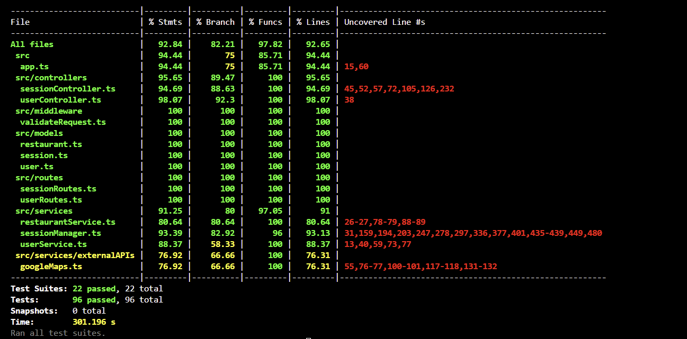
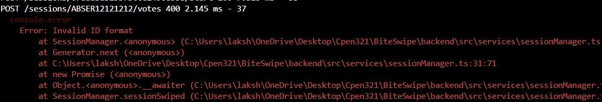
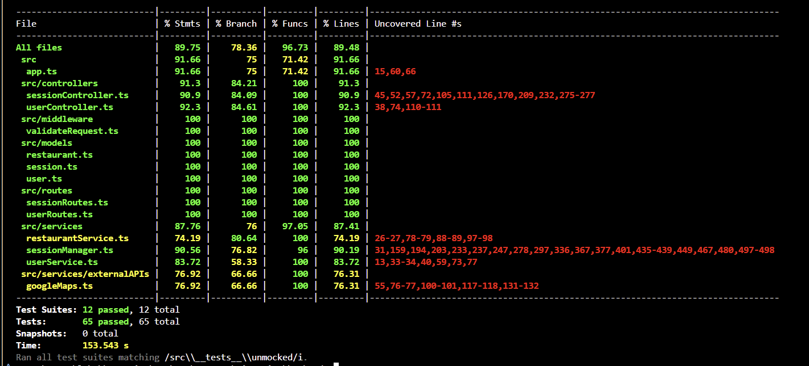

# BiteSwipe M5: Testing and Code Review

  

## 1. Change History

  

| **Change Date** | **Modified Sections** | **Rationale** |
| ----------------- | --------------------- | ------------- |
| _10 March 2025_ | created document | N/A |
| _17 March 2025_ | Added Frontend Components to doc | TODO|

---

  

## 2. Back-end Test Specification: APIs

  

### 2.1. Locations of Back-end Tests and Instructions to Run Them

  

#### 2.1.1. Tests

  

| **Interface** | **Describe Group Location, No Mocks** | **Describe Group Location, With Mocks** | **Mocked Components** |
| ----------------------------- | ---------------------------------------------------- | -------------------------------------------------- | ---------------------------------- |
| **POST /user/login** | [`tests/unmocked/authenticationLogin.test.js#L1`](#) | [`tests/mocked/authenticationLogin.test.js#L1`](#) | Google Authentication API, User DB |
| **GET /sessions/:sessionId** |[`/backend/src/__tests__/unmocked/sessions_sessionid_get.test.ts#L38`](#) | [`/backend/src/__tests__/mocked/sessions_post.test.ts#L36`](#) | Restaurant DB, User DB |
| **POST /sessions** | [`/backend/src/__tests__/unmocked/sessions_post.test.ts#L59`](#) | [`/backend/src/__tests__/mocked/sessions_post.test.ts#L36`](#) | Restaurant DB, User DB, Google API |
| **POST /sessions/:sessionId/invitations** | [`/backend/src/__test__/unmocked/sessions_sessionid_invitations_post.test.ts#L55`](#) |   |  |
| **DELETE /sessions/:sessionId/invitations/:userId** | [`/backend/src/__tests__/unmocked/sessions_sessionid_invitations_userid_delete.test.ts#L52`](#) |  |  |
| **DELETE /sessions/:sessionId/participants/:userId** | [`/backend/src/__tests__/unmocked/sessions_session_swiped.test.ts#L285`](#) | [`/backend/src/__tests__/mocked/sessions_leave_delete.test.ts#L117`](#) | Session DB |
| **POST /sessions/:joinCode/participants** | [`/backend/src/__tests__/unmocked/sessions_session_join_post.test.ts#L131`](#) | [`/backend/src/__tests__/mocked/sessions_joinSession_post.test.ts#L135`](#) | Session DB |
| **POST /sessions/:sessionId/votes** | [`/backend/src/__tests__/unmocked/sessions_session_swiped.test.ts#L199`](#) | [`/backend/src/__tests__/mocked/sessions_swiped.test.ts#L378`](#)  | User DB, Session DB |
| **POST /sessions/:sessionId/start** | [`/backend/src/__tests__/unmocked/sessions_session_swiped.test.ts#L162`](#) |  |  |
| **POST /sessions/:sessionId/doneSwiping** | [`/backend/src/__tests__/unmocked/sessions_session_swiped.test.ts#L264`](#) | [`/backend/src/__tests__/mocked/sessions_doneSwiping_post.test.ts#L128`](#) | Session DB |
| **GET /sessions/:sessionId/result** | [`/backend/src/__tests__/unmocked/sessions_session_swiped.test.ts#L281`](#) | [`/backend/src/__tests__/mocked/sessions_result_get.test.ts#L114`](#) | Session DB |
| **GET /users/:userId** | [`/backend/src/__tests__/unmocked/users_userid_get.test.ts#L53`](#)  | [`/backend/src/__tests__/mocked/create_get_user.test.ts#L219`](#) | User DB |
| **POST /users** | [`/backend/src/__tests__/unmocked/users_post.test.ts#L66`](#) | [`/backend/src/__tests__/mocked/create_get_user.test.ts#L161`](#) | User DB |
| **POST /users/:userId/fcm-token** | [`/backend/src/__tests__/unmocked/users_userid_fcmtoken_post.test.ts#L49`](#) | [`/backend/src/__tests__/mocked/users_userid_fcmtoken_post.test.ts#L75`](#) | User DB |
| **GET /users/:userId/sessions** | [`/backend/src/__tests__/unmocked/users_userid_sessions_get.test.ts#L52`](#) |  |  |
| **GET /users/emails/:email** | [`/backend/src/__tests__/unmocked/users_emails_email_get.test.ts#L56`](#) | [`/backend/src/__tests__/mocked/create_get_user.test.ts#L252`](#) [`/backend/src/__tests__/mocked/users_emails_email_get.test.ts#L66`](#)  | User DB |


#### 2.1.2. Commit Hash Where Tests Run

  

`18925975d1eeb65c73d4bc9cf6548f6f5dffb0b4`

  

#### 2.1.3. Explanation on How to Run the Tests

  

1. **Clone the Repository**:

  

- Open your terminal and run:

```

git clone https://github.com/BiteSwipe321/BiteSwipe.git

```

  

2. **Set up environment variables at .env**

```
# Backend port
PORT=3000

# Databases 
DB_URI=mongodb://mongo:27017/biteswipe

# Maps
GOOGLE_MAPS_API_KEY=your_google_maps_api_key_here

# Firebase
# Note: Firebase authentication now uses the service account JSON file
# located at the backend root directory (biteswipe-132f1-firebase-adminsdk-fbsvc-76c5bb6fe5.json)
FIREBASE_CREDENTIALS_JSON_PATHNAME=<repo_root>/backend/biteswipe-132f1-firebase-adminsdk-fbsvc-76c5bb6fe5.json

```

3. **In backend, put the file biteswipe-132f1-firebase-adminsdk-fbsvc-76c5bb6fe5.json, contact our group to obtain the file**

4. **Running Tests**

`Mock Test and Coverage Commands`

```
npm run test:coverage:mocked

```

`UnMock Test and Coverage Commands`

```
npm run test:coverage:unmocked

```

`Combined Mock and Unmock Test and Coverage Commands`

```
npm run test:coverage

```
  

### 2.2. GitHub Actions Configuration Location

  

`~/.github/workflows/backend-tests.yml`

  

### 2.3. Jest Coverage Report Screenshots With Mocks

  

For the app.js there are two uncoverd lines, **line 15** is not covered since that line is in async error handler and this relies on next function from express middleware chain, and their is no proper way to mock the entire express middleware chain also the error handling is part of a higher-order function that wraps route handlers, making it an implementation detail rather than directly exposed functionality, whereas for **line 60**
the requirement is to hit a non http endpoint which can't be simulate through the jest framework

for SessionManager all the Errors are comming from the same checking condition (Types.Object.isValid()) and although we are hitting that condition using our unmock testing and for instance in mock testing as well, it is still showing to be uncovered in coverag, there were some online post regarding this validation check in jest, which was saying that the Types.Object.isValid() validation is executed within branching logic that Jest's code instrumentation has difficulty tracking properly, resulting in reported coverage gaps despite functional execution. Additionally, this validation is often part of error handling paths that may execute conditionally based on MongoDB's internal implementation details, making consistent coverage reporting challenging across different test environments.

also a screenshoot showing that we are indeed hitting that statement using our testing suite 


for UserService all the Errors are comming form the same checking condition as the sessionManager and have the same reasoning

for SessionController -->

for UserController -->

for googleMapsAPI --> 

  

### 2.4. Jest Coverage Report Screenshots Without Mocks

  



  

---


## 3. Back-end Test Specification: Tests of Non-Functional Requirements

  

### 3.1. Test Locations in Git

  

| **Non-Functional Requirement** | **Location in Git** |
| ------------------------------- | ------------------------------------------------ |
| **Performance (App Load Time)** | [`frontend/app/src/androidTest/java/com/example/biteswipe/FNFRTests.kt`](#) |
| **Uptime** | [`frontend/app/src/androidTest/java/com/example/biteswipe/FNFRTests.kt`](#) |  
| **Usability** | ['frontend/app/src/androidTest/java/com/example/biteswipe/EUsabilityNFRTest.kt'](#) |

### 3.2. Test Verification and Logs

  

- **Performance (Load Time)**

  

- **Verification:** This test ensures that our application is responsive and does not load unnessacry bloat at startup. The 5 second treshhold is defined by Google's recommended app performance metrics.

- **Log Output**

<div style="margin-left: 40px;">


| Timestamp               | PID         | Tag         | Package               | Level | Message                                                                 |
|-------------------------|-------------|-------------|------------------------|-------|-------------------------------------------------------------------------|
| 2025-03-21 17:38:24.137 | 11440-11457 | TestRunner  | com.example.biteswipe | I     | started: loginScreenLoadsUnder5Seconds(com.example.biteswipe.FNFRTests) |
| 2025-03-21 17:38:25.357 | 11440-11457 | TestRunner  | com.example.biteswipe | I     | finished: loginScreenLoadsUnder5Seconds(com.example.biteswipe.FNFRTests) |


</div>

  

- **Uptime**

- **Verification:** This test verifies that the server is up and running at the time of the test. This test is sufficient because the NFR only requires verifying that the server is accessible when the app is in use. Successfully reaching the server confirms it is operational and able to support user actions, which satisfies the availability requirement for a course-level project. The only real way to measure uptime over time would be to use an external monitoring service, which is beyond the scope of this test suite.

- **Log Output**

```

[Placeholder for uptime test logs]

```
- **Usability**
- **Verification: ** This test verifies the user is able to access all menu items correctly and smoothly under an appropriate response time. This test is sufficient as we are simply looking to see if the user can access all the menus smoothly, rather than checking the functionality of each page.

- **Log Output**

  <div style="margin-left: 40px;">


| Timestamp               | Process ID | Thread ID | Component        | Package                         | Level | Message                                                                 |
|-------------------------|-----------|----------|------------------|--------------------------------|-------|-------------------------------------------------------------------------|
| 2025-03-21 20:48:59.060 | 27928     | 27945    | TestRunner       | com.example.biteswipe         | I     | started: testA_Navigation(com.example.biteswipe.EUsabilityNFRTest)     |
| 2025-03-21 20:49:00.499 | 27928     | 27928    | ViewInteraction  | com.example.biteswipe         | I     | Performing 'single click' action on view view.getId() is <2131231185/com.example.biteswipe:id/sign_in_button> |
| 2025-03-21 20:49:25.117 | 27928     | 27928    | ViewInteraction  | com.example.biteswipe         | I     | Checking 'MatchesViewAssertion{viewMatcher=(view has effective visibility <VISIBLE> and view.getGlobalVisibleRect() to return non-empty rectangle)}' assertion on view view.getId() is <2131231008/com.example.biteswipe:id/main_join_group_button> |
| 2025-03-21 20:49:25.136 | 27928     | 27928    | ViewInteraction  | com.example.biteswipe         | I     | Performing 'single click' action on view view.getId() is <2131231007/com.example.biteswipe:id/main_friends_button> |
| 2025-03-21 20:49:27.095 | 27928     | 27928    | ViewInteraction  | com.example.biteswipe         | I     | Performing 'single click' action on view view.getId() is <2131230942/com.example.biteswipe:id/friends_back_button> |
| 2025-03-21 20:49:28.911 | 27928     | 27928    | ViewInteraction  | com.example.biteswipe         | I     | Performing 'single click' action on view view.getId() is <2131231008/com.example.biteswipe:id/main_join_group_button> |
| 2025-03-21 20:49:30.611 | 27928     | 27928    | ViewInteraction  | com.example.biteswipe         | I     | Performing 'single click' action on view view.getId() is <2131230986/com.example.biteswipe:id/join_back_button> |
| 2025-03-21 20:49:31.111 | 27928     | 27928    | ViewInteraction  | com.example.biteswipe         | I     | Performing 'single click' action on view view.getId() is <2131231006/com.example.biteswipe:id/main_create_group_button> |
| 2025-03-21 20:49:37.238 | 27928     | 27928    | ViewInteraction  | com.example.biteswipe         | I     | Performing 'single click' action on view view.getId() is <2131230868/com.example.biteswipe:id/create_back_button> |
| 2025-03-21 20:49:38.185 | 27928     | 27945    | TestRunner       | com.example.biteswipe         | I     | finished: testA_Navigation(com.example.biteswipe.EUsabilityNFRTest)     |
| 2025-03-21 20:49:38.625 | 27928     | 27945    | TestRunner       | com.example.biteswipe         | I     | run finished: 1 tests, 0 failed, 0 ignored                             |

</div>
  

---

  

## 4. Front-end Test Specification

  

### 4.1. Location in Git of Front-end Test Suite:

  

`frontend/src/androidTest/java/com/biteswipe/`

  

### 4.2. Tests

  

- **Use Case: Login**

  

- **Expected Behaviors:**

| **Scenario Steps** | **Test Case Steps** |
| --- | --- |
| 1. The user opens the app. | Launch LoginPage activity. |
| 2. The system displays the login screen with a "Sign in with Google" button. | N/A |
| 3. The user taps the "Sign in with Google" button. | Click the button labeled "Sign in with Google". |
| 3a. The user denies the Google authentication request. | Click away from the Google authentication page. |
| 3a1. The system returns to the login screen with a message: "Sign-in required." | Check that the login screen is displayed again. Check that an error message "Sign-in required." is displayed. |
| 4. The system redirects the user to Google's authentication page. | Check that the Google authentication page is displayed. |
| 5. The user selects or enters their Google account credentials. | Input valid Google account credentials and submit. |
| 5a. Network failure during authentication. | N/A Backend mock required |
| 5a1. The system displays an error message: "No internet connection. Please try again." | N/A |
| 5a2. The user retries login once the network is restored. | N/A |
| 6. The system verifies authentication with Google and grants access. | Check that authentication is successfully verified. |
| 6a. Google authentication service is unavailable. | N/A |
| 6a1. The system displays an error message: "Google sign-in is currently unavailable." | N/A |
| 6a2. The user is advised to try again later. | N/A |
| 7. The system redirects the user back to the app, now logged in. | Check that the user is redirected back to the home page. |

- **Test Logs**
<div style="margin-left: 40px;">

| Timestamp            | PID         | Tag               | Package                     | Level | Message                                                                 |
|----------------------|------------|-------------------|-----------------------------|-------|-------------------------------------------------------------------------|
| 2025-03-21 01:58:41.485 | 11146-11163 | TestRunner       | com.example.biteswipe      | I     | started: testA_Login(com.example.biteswipe.ALoginPageTest)            |
| 2025-03-21 01:58:42.443 | 11146-11146 | ViewInteraction  | com.example.biteswipe      | I     | Performing 'single click' action on view view.getId() is <2131231185/com.example.biteswipe:id/sign_in_button> |
| 2025-03-21 01:58:56.893 | 11146-11146 | ViewInteraction  | com.example.biteswipe      | I     | Checking 'MatchesViewAssertion{viewMatcher=(view has effective visibility <VISIBLE> and view.getGlobalVisibleRect() to return non-empty rectangle)}' assertion on view view.getId() is <2131231008/com.example.biteswipe:id/main_join_group_button> |
| 2025-03-21 01:58:56.932 | 11146-11146 | ViewInteraction  | com.example.biteswipe      | I     | Performing 'Get text from TextView' action on view view.getId() is <2131231235/com.example.biteswipe:id/test_user_id> |
| 2025-03-21 01:58:57.846 | 11146-11163 | TestRunner       | com.example.biteswipe      | I     | finished: testA_Login(com.example.biteswipe.ALoginPageTest)           |

</div>


- **Use Case: Swipe to Select Restaurants**

  

- **Expected Behaviors:**

| **Scenario Steps** | **Test Case Steps** |
| --- | --- |
| 1. The screen displays a restaurant suggestion, including the name, image, rating, and short description. | Check that a restaurant suggestion is displayed in the recycler view. |
| 1a. No restaurants are available when the user navigates to the selection screen. | Check if restaurant recycler view has any children |
| 1a1. Instead of showing a restaurant, the app displays the message: "No restaurants available at this time." | Check for text on the screen |
| 2. The user swipes right to like or left to dislike the restaurant. | Swipe right to like a restaurant. Swipe left to dislike a restaurant. |
| 3. The screen briefly shows a confirmation animation. | N/A Can’t be tested with Espresso |
| 4. A new restaurant suggestion appears. | Check that the restaurant recycler view has less children than it did before |
| 4a. Network failure while loading the next restaurant. | N/A Backend mocking |
| 4a1. The screen displays a message: "Network error. Please check your connection and try again." | N/A Backend mocking |
| 4a2. The user can retry by tapping "Reload", or exit the screen. | N/A Backend mocking |
| 5. Steps 3-5 repeat until no more restaurant suggestions are available. | Continue swiping until all restaurant suggestions are exhausted. |
| 6. If no restaurants remain, the app displays a message: "Waiting for other users to finish…" | Check text "Waiting for other users to finish…" is displayed, check that recycler view is invisible|


- **Test Logs:**

<div style="margin-left: 40px;">


| Timestamp               | Thread ID | Component            | Package                          | Log Level | Message                                                                                   |
|-------------------------|-----------|----------------------|----------------------------------|-----------|-------------------------------------------------------------------------------------------|
| 2025-03-21 02:00:41.685 | 11146-11163 | TestRunner           | com.example.biteswipe            | I         | started: testA_WorkingUI(com.example.biteswipe.DSwipeTest)                               |
| 2025-03-21 02:00:52.043 | 11146-11146 | ViewInteraction      | com.example.biteswipe            | I         | Checking 'MatchesViewAssertion{viewMatcher=(view has effective visibility <VISIBLE> and view.getGlobalVisibleRect() to return non-empty rectangle)}' assertion on view view.getId() is <2131231135/com.example.biteswipe:id/recycler_view> |
| 2025-03-21 02:00:52.046 | 11146-11146 | ViewInteraction      | com.example.biteswipe            | I         | Checking 'MatchesViewAssertion{viewMatcher=view has effective visibility <INVISIBLE>}' assertion on view view.getId() is <2131231305/com.example.biteswipe:id/waiting_for_finish_text> |
| 2025-03-21 02:00:52.049 | 11146-11146 | ViewInteraction      | com.example.biteswipe            | I         | Checking 'MatchesViewAssertion{viewMatcher=an instance of android.view.ViewGroup and viewGroup.getChildCount() to be at least <1>}' assertion on view view.getId() is <2131231135/com.example.biteswipe:id/recycler_view> |
| 2025-03-21 02:00:52.424 | 11146-11163 | TestRunner           | com.example.biteswipe            | I         | finished: testA_WorkingUI(com.example.biteswipe.DSwipeTest)                               |
| 2025-03-21 02:00:52.833 | 11146-11163 | TestRunner           | com.example.biteswipe            | I         | started: testB_SwipeLeftTest(com.example.biteswipe.DSwipeTest)                           |
| 2025-03-21 02:01:03.289 | 11146-11146 | ViewInteraction      | com.example.biteswipe            | I         | Checking 'com.example.biteswipe.DSwipeTest$$ExternalSyntheticLambda1@b16d10' assertion on view view.getId() is <2131231135/com.example.biteswipe:id/recycler_view> |
| 2025-03-21 02:01:03.293 | 11146-11146 | ViewInteraction      | com.example.biteswipe            | I         | Performing 'actionOnItemAtPosition performing ViewAction: fast swipe on item at position: 0' action on view view.getId() is <2131231135/com.example.biteswipe:id/recycler_view> |
| 2025-03-21 02:01:03.546 | 11146-11146 | ViewInteraction      | com.example.biteswipe            | I         | Checking 'MatchesViewAssertion{viewMatcher=an instance of android.view.ViewGroup and viewGroup.getChildCount() to be at least <8>}' assertion on view view.getId() is <2131231135/com.example.biteswipe:id/recycler_view> |
| 2025-03-21 02:01:04.001 | 11146-11163 | TestRunner           | com.example.biteswipe            | E         | failed: testB_SwipeLeftTest(com.example.biteswipe.DSwipeTest)                             |
| 2025-03-21 02:01:04.004 | 11146-11163 | TestRunner           | com.example.biteswipe            | I         | finished: testB_SwipeLeftTest(com.example.biteswipe.DSwipeTest)                           |
| 2025-03-21 02:01:14.808 | 11146-11146 | ViewInteraction      | com.example.biteswipe            | I         | Checking 'com.example.biteswipe.DSwipeTest$$ExternalSyntheticLambda2@c18f548' assertion on view view.getId() is <2131231135/com.example.biteswipe:id/recycler_view> |
| 2025-03-21 02:01:14.811 | 11146-11146 | ViewInteraction      | com.example.biteswipe            | I         | Performing 'actionOnItemAtPosition performing ViewAction: fast swipe on item at position: 0' action on view view.getId() is <2131231135/com.example.biteswipe:id/recycler_view> |
| 2025-03-21 02:01:15.061 | 11146-11146 | ViewInteraction      | com.example.biteswipe            | I         | Checking 'MatchesViewAssertion{viewMatcher=an instance of android.view.ViewGroup and viewGroup.getChildCount() to be at least <8>}' assertion on view view.getId() is <2131231135/com.example.biteswipe:id/recycler_view> |
| 2025-03-21 02:01:15.384 | 11146-11163 | TestRunner           | com.example.biteswipe            | E         | failed: testC_SwipeRightTest(com.example.biteswipe.DSwipeTest)                            |
| 2025-03-21 02:01:15.387 | 11146-11163 | TestRunner           | com.example.biteswipe            | I         | finished: testC_SwipeRightTest(com.example.biteswipe.DSwipeTest)                           |
| 2025-03-21 02:01:15.736 | 11146-11163 | TestRunner           | com.example.biteswipe            | I         | started: testD_FinishSwipingTest(com.example.biteswipe.DSwipeTest)                        |
| 2025-03-21 02:01:26.144 | 11146-11146 | ViewInteraction      | com.example.biteswipe            | I         | Checking 'com.example.biteswipe.DSwipeTest$$ExternalSyntheticLambda0@3b90686' assertion on view view.getId() is <2131231135/com.example.biteswipe:id/recycler_view> |
| 2025-03-21 02:01:26.148 | 11146-11146 | ViewInteraction      | com.example.biteswipe            | I         | Performing 'actionOnItemAtPosition performing ViewAction: fast swipe on item at position: 0' action on view view.getId() is <2131231135/com.example.biteswipe:id/recycler_view> |
| 2025-03-21 02:01:28.394 | 11146-11146 | ViewInteraction      | com.example.biteswipe            | I         | Performing 'actionOnItemAtPosition performing ViewAction: fast swipe on item at position: 0' action on view view.getId() is <2131231135/com.example.biteswipe:id/recycler_view> |
| 2025-03-21 02:01:30.643 | 11146-11146 | ViewInteraction      | com.example.biteswipe            | I         | Performing 'actionOnItemAtPosition performing ViewAction: fast swipe on item at position: 0' action on view view.getId() is <2131231135/com.example.biteswipe:id/recycler_view> |
| 2025-03-21 02:01:32.892 | 11146-11146 | ViewInteraction      | com.example.biteswipe            | I         | Performing 'actionOnItemAtPosition performing ViewAction: fast swipe on item at position: 0' action on view view.getId() is <2131231135/com.example.biteswipe:id/recycler_view> |
| 2025-03-21 02:01:35.141 | 11146-11146 | ViewInteraction      | com.example.biteswipe            | I         | Performing 'actionOnItemAtPosition performing ViewAction: fast swipe on item at position: 0' action on view view.getId() is <2131231135/com.example.biteswipe:id/recycler_view> |
| 2025-03-21 02:01:37.390 | 11146-11146 | ViewInteraction      | com.example.biteswipe            | I         | Performing 'actionOnItemAtPosition performing ViewAction: fast swipe on item at position: 0' action on view view.getId() is <2131231135/com.example.biteswipe:id/recycler_view> |
| 2025-03-21 02:01:39.641 | 11146-11146 | ViewInteraction      | com.example.biteswipe            | I         | Performing 'actionOnItemAtPosition performing ViewAction: fast swipe on item at position: 0' action on view view.getId() is <2131231135/com.example.biteswipe:id/recycler_view> |
| 2025-03-21 02:01:41.895 | 11146-11146 | ViewInteraction      | com.example.biteswipe            | I         | Performing 'actionOnItemAtPosition performing ViewAction: fast swipe on item at position: 0' action on view view.getId() is <2131231135/com.example.biteswipe:id/recycler_view> |
| 2025-03-21 02:01:44.142 | 11146-11146 | ViewInteraction      | com.example.biteswipe            | I         | Performing 'actionOnItemAtPosition performing ViewAction: fast swipe on item at position: 0' action on view view.getId() is <2131231135/com.example.biteswipe:id/recycler_view> |
| 2025-03-21 02:01:47.392 | 11146-11146 | ViewInteraction      | com.example.biteswipe            | I         | Checking 'MatchesViewAssertion{viewMatcher=view has effective visibility <INVISIBLE>}' assertion on view view.getId() is <2131231135/com.example.biteswipe:id/recycler_view> |
| 2025-03-21 02:01:47.621 | 11146-11163 | TestRunner           | com.example.biteswipe            | E         | failed: testD_FinishSwipingTest(com.example.biteswipe.DSwipeTest)                         |
| 2025-03-21 02:01:47.624 | 11146-11163 | TestRunner           | com.example.biteswipe            | I         | finished: testD_FinishSwipingTest(com.example.biteswipe.DSwipeTest)                       |

</div>

  

- **Use Case: Create A Session**

  

- **Expected Behaviors:**

 | **Scenario Steps** | **Test Case Steps** |
| --- | --- |
| 1. The group creator taps the “Create Group” button from the main page. | Click the button labeled "Create Group" on the main page. |
| 2. The screen displays input fields for: Radius, Cuisine preferences. | Check that input fields for "Radius" and "Cuisine preferences" are displayed. |
| 3. The group creator enters the required details. | Enter valid values for "Radius" and "Cuisine preferences." |
| 3a. Invalid input (missing location or preferences). | Leave one or both input fields empty and attempt to proceed. |
| 3a1. The system highlights missing fields and displays a message: "Please fill in all required fields." | Check intent hasn’t changed (still in Create A Session) page|
| 4. The group creator taps the "Create Session" button. | Click the button labeled "Create Session." |
| 5. The system confirms session creation and displays: A confirmation message, A unique join code for other users to join the session, A list of users in the session, A Start Matching button. | Check that a confirmation message is displayed.<br>Check that a unique join code is generated and displayed.<br>Check that a list of users in the session is displayed.<br>Check that a button labeled "Start Matching" is present. |
| 5a. Server error prevents session creation. | N/A Backend mocking |
| 5a1. The system displays an error toast: "Error: Please try again" | Check if intent remains the same |
| 5a2. The group creator can retry after some time. | Check if intent remains the same  |


- **Test Logs:**

<div style="margin-left: 40px;">


| Timestamp            | PID         | Tag               | Package                     | Level | Message                                                                 |
|----------------------|------------|-------------------|-----------------------------|-------|-------------------------------------------------------------------------|
| 2025-03-21 01:58:58.719 | 11146-11163 | TestRunner       | com.example.biteswipe      | I     | started: testA_WorkingUI(com.example.biteswipe.BCreateGroupTest)       |
| 2025-03-21 01:59:09.191 | 11146-11146 | ViewInteraction  | com.example.biteswipe      | I     | Checking 'MatchesViewAssertion' on view <2131231250/id/textView2>      |
| 2025-03-21 01:59:09.197 | 11146-11146 | ViewInteraction  | com.example.biteswipe      | I     | Checking 'MatchesViewAssertion' on view <2131230869/id/create_group_button> |
| 2025-03-21 01:59:09.200 | 11146-11146 | ViewInteraction  | com.example.biteswipe      | I     | Checking 'MatchesViewAssertion' on view <2131231164/id/searchRadiusText> |
| 2025-03-21 01:59:09.472 | 11146-11163 | TestRunner       | com.example.biteswipe      | I     | finished: testA_WorkingUI(com.example.biteswipe.BCreateGroupTest)      |
| 2025-03-21 01:59:09.747 | 11146-11163 | TestRunner       | com.example.biteswipe      | I     | started: testB_InvalidParameters(com.example.biteswipe.BCreateGroupTest) |
| 2025-03-21 01:59:19.116 | 11146-11146 | ViewInteraction  | com.example.biteswipe      | I     | Performing 'type text(0)' on view <2131231164/id/searchRadiusText>     |
| 2025-03-21 01:59:20.029 | 11146-11146 | ViewInteraction  | com.example.biteswipe      | I     | Performing 'single click' on view <2131230869/id/create_group_button>  |
| 2025-03-21 01:59:23.346 | 11146-11146 | ViewInteraction  | com.example.biteswipe      | I     | Checking assertion on view view.getRootView() to equal view            |
| 2025-03-21 01:59:23.361 | 11146-11146 | ViewInteraction  | com.example.biteswipe      | I     | Performing 'actionOnItemAtPosition' on view <2131230872/id/cuisine_recycler_view> |
| 2025-03-21 01:59:23.423 | 11146-11146 | ViewInteraction  | com.example.biteswipe      | I     | Performing 'single click' on view <2131230869/id/create_group_button>  |
| 2025-03-21 01:59:27.093 | 11146-11163 | TestRunner       | com.example.biteswipe      | I     | finished: testB_InvalidParameters(com.example.biteswipe.BCreateGroupTest) |
| 2025-03-21 01:59:27.353 | 11146-11163 | TestRunner       | com.example.biteswipe      | I     | started: testC_CreateButton(com.example.biteswipe.BCreateGroupTest)    |
| 2025-03-21 01:59:37.205 | 11146-11146 | ViewInteraction  | com.example.biteswipe      | I     | Performing 'type text(1000)' on view <2131231164/id/searchRadiusText>  |
| 2025-03-21 01:59:42.943 | 11146-11146 | ViewInteraction  | com.example.biteswipe      | I     | Performing 'single click' on view <2131230869/id/create_group_button>  |
| 2025-03-21 01:59:51.247 | 11146-11146 | ViewInteraction  | com.example.biteswipe      | I     | Checking assertion on view view.getRootView() to equal view            |
| 2025-03-21 01:59:51.254 | 11146-11146 | ViewInteraction  | com.example.biteswipe      | I     | Performing 'Get text from TextView' on view <2131231122/id/placeholderText> |
| 2025-03-21 01:59:51.261 | 11146-11146 | ViewInteraction  | com.example.biteswipe      | I     | Performing 'single click' on view <2131231178/id/share_group_button>   |
| 2025-03-21 01:59:51.790 | 11146-11146 | ViewInteraction  | com.example.biteswipe      | I     | Performing 'type text(byteswiper@gmail.com)' on view <2131231079/id/new_member_text> |
| 2025-03-21 01:59:54.077 | 11146-11146 | ViewInteraction  | com.example.biteswipe      | I     | Performing 'single click' on view <2131230794/id/add_member_button>    |
| 2025-03-21 01:59:59.377 | 11146-11163 | TestRunner       | com.example.biteswipe      | I     | finished: testC_CreateButton(com.example.biteswipe.BCreateGroupTest)   |

</div>

**Use Case: Join A Session**

  

- **Expected Behaviors:**


| **Scenario Steps** | **Test Case Steps** |
| ------------------ | ------------------- |
| 1. The user opens the “Join Group” page | Check valid intent |
| 2. The system displays a text input field labeled "Enter Join Code" | Check UI elements on screen (textinput, button) |
| 3a. The user enters an invalid join code and taps "Join" | Type in usercode, and click the join button |
| 3a1. The system displays an error toast saying "Invalid Group Code, try again"| Check after wait time intent has not changed |
| 3. The user enters a valid join code| type in correct usercode |
| 4. The user clicks the "Join" button. | Click join button|
| 5. The screen transitions to the Group Members page, displaying: - The session name - A list of all members in the group | Check to see intent has changed |


  

- **Test Logs:**

<div style="margin-left: 40px;">


| Timestamp               | Thread ID | Component            | Package                          | Log Level | Message                                                                                   |
|-------------------------|----------|----------------------|----------------------------------|-----------|-------------------------------------------------------------------------------------------|
| 2025-03-21 01:59:59.846 | 11146-11163 | TestRunner         | com.example.biteswipe          | I         | started: testA_SignIn(com.example.biteswipe.CJoinGroupTest)                              |
| 2025-03-21 02:00:00.138 | 11146-11146 | ViewInteraction    | com.example.biteswipe          | I         | Performing 'single click' action on view view.getId() is <2131231185/com.example.biteswipe:id/sign_in_button> |
| 2025-03-21 02:00:14.819 | 11146-11146 | ViewInteraction    | com.example.biteswipe          | I         | Performing 'Get userId from TextView' action on view view.getId() is <2131231235/com.example.biteswipe:id/test_user_id> |
| 2025-03-21 02:00:14.823 | 11146-11146 | ViewInteraction    | com.example.biteswipe          | I         | Performing 'single click' action on view view.getId() is <2131231008/com.example.biteswipe:id/main_join_group_button> |
| 2025-03-21 02:00:18.762 | 11146-11163 | TestRunner         | com.example.biteswipe          | I         | finished: testA_SignIn(com.example.biteswipe.CJoinGroupTest)                             |
| 2025-03-21 02:00:19.023 | 11146-11163 | TestRunner         | com.example.biteswipe          | I         | started: testB_WorkingUI(com.example.biteswipe.CJoinGroupTest)                           |
| 2025-03-21 02:00:19.309 | 11146-11146 | ViewInteraction    | com.example.biteswipe          | I         | Checking 'MatchesViewAssertion' assertion on view view.getId() is <2131231270/com.example.biteswipe:id/titleText> |
| 2025-03-21 02:00:19.313 | 11146-11146 | ViewInteraction    | com.example.biteswipe          | I         | Checking 'MatchesViewAssertion' assertion on view view.getId() is <2131230951/com.example.biteswipe:id/groupIdInputLayout> |
| 2025-03-21 02:00:19.318 | 11146-11146 | ViewInteraction    | com.example.biteswipe          | I         | Checking 'MatchesViewAssertion' assertion on view view.getId() is <2131230987/com.example.biteswipe:id/join_button> |
| 2025-03-21 02:00:19.323 | 11146-11146 | ViewInteraction    | com.example.biteswipe          | I         | Checking 'MatchesViewAssertion' assertion on view view.getId() is <2131230986/com.example.biteswipe:id/join_back_button> |
| 2025-03-21 02:00:19.328 | 11146-11146 | ViewInteraction    | com.example.biteswipe          | I         | Checking 'MatchesViewAssertion' assertion on view view.getId() is <2131231247/com.example.biteswipe:id/textView13> |
| 2025-03-21 02:00:19.330 | 11146-11163 | TestRunner         | com.example.biteswipe          | I         | finished: testB_WorkingUI(com.example.biteswipe.CJoinGroupTest)                           |
| 2025-03-21 02:00:19.644 | 11146-11163 | TestRunner         | com.example.biteswipe          | I         | started: testC_BadCode(com.example.biteswipe.CJoinGroupTest)                              |
| 2025-03-21 02:00:24.299 | 11146-11146 | ViewInteraction    | com.example.biteswipe          | I         | Performing 'type text(12345)' action on view view.getId() is <2131230954/com.example.biteswipe:id/group_id_input> |
| 2025-03-21 02:00:24.812 | 11146-11146 | ViewInteraction    | com.example.biteswipe          | I         | Performing 'close keyboard' action on view view.getId() is <2131230954/com.example.biteswipe:id/group_id_input> |
| 2025-03-21 02:00:25.161 | 11146-11146 | ViewInteraction    | com.example.biteswipe          | I         | Performing 'single click' action on view view.getId() is <2131230987/com.example.biteswipe:id/join_button> |
| 2025-03-21 02:00:28.463 | 11146-11163 | TestRunner         | com.example.biteswipe          | I         | finished: testC_BadCode(com.example.biteswipe.CJoinGroupTest)                              |
| 2025-03-21 02:00:28.929 | 11146-11163 | TestRunner         | com.example.biteswipe          | I         | started: testD_JoinButton(com.example.biteswipe.CJoinGroupTest)                           |
| 2025-03-21 02:00:29.325 | 11146-11146 | ViewInteraction    | com.example.biteswipe          | I         | Performing 'type text(BU5XF)' action on view view.getId() is <2131230954/com.example.biteswipe:id/group_id_input> |
| 2025-03-21 02:00:29.924 | 11146-11146 | ViewInteraction    | com.example.biteswipe          | I         | Performing 'close keyboard' action on view view.getId() is <2131230954/com.example.biteswipe:id/group_id_input> |
| 2025-03-21 02:00:30.253 | 11146-11146 | ViewInteraction    | com.example.biteswipe          | I         | Performing 'single click' action on view view.getId() is <2131230987/com.example.biteswipe:id/join_button> |
| 2025-03-21 02:00:40.559 | 11146-11146 | ViewInteraction    | com.example.biteswipe          | I         | Checking 'androidx.test.espresso.intent.Intents$2@6a57e5' assertion on view view.getRootView() to equal view |
| 2025-03-21 02:00:41.201 | 11146-11163 | TestRunner         | com.example.biteswipe          | I         | finished: testD_JoinButton(com.example.biteswipe.CJoinGroupTest)                           |

</div>

  
  

---

  


## 5. Automated Code Review Results

  

### 5.1. Commit Hash Where Codacy Ran

  

`[Insert Commit SHA here]`

  

### 5.2. Unfixed Issues per Codacy Category

  

_(Placeholder for screenshots of Codacy’s Category Breakdown table in Overview)_

  

### 5.3. Unfixed Issues per Codacy Code Pattern

  

_(Placeholder for screenshots of Codacy’s Issues page)_

  

### 5.4. Justifications for Unfixed Issues

  

- **Code Pattern: [Usage of Deprecated Modules](#)**

  

1. **Issue**

  

- **Location in Git:** [`src/services/chatService.js#L31`](#)

- **Justification:** ...

  

2. ...

  

- ...
